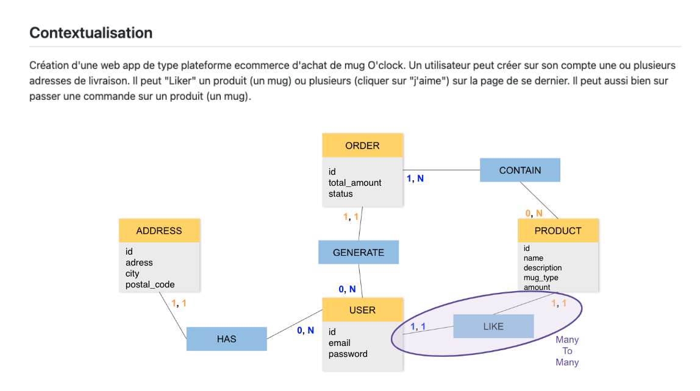

<h1>Évaluation de la réalisation du MCD par l'apprenant</h1>

Suite à l'examen de votre Modèle Conceptuel de Données (MCD) réalisé selon la méthode MERISE, je tiens à vous faire part de mon évaluation sur votre travail.

<h2>Points forts :</h2>
1. Vous avez suivi la méthode MERISE pour la modélisation de votre MCD, ce qui montre que vous avez compris les bases de cette approche.
Les cardinalités des relations entre Address-User, User-Order et Product-Order sont correctes et montrent une compréhension des contraintes entre les entités.

<h2>Points à améliorer :</h2>
1. La relation entre User et Product nécessitait une correction concernant les cardinalités. Vous aviez initialement mis les cardinalités 1,1 et 1,1, 
alors qu'une relation Many-to-Many (0,n et 0,n) serait plus appropriée pour représenter la relation entre ces entités. Cela permettrait de montrer que 
0 ou plusieurs utilisateurs peuvent aimer 0 ou plusieurs produits.

<h2>Recommandations pour l'avenir :</h2>
Soyez attentif aux cardinalités entre les entités et vérifiez qu'elles représentent correctement les relations possibles dans votre système.
N'hésitez pas à utiliser des outils de modélisation pour vous aider à visualiser et valider votre MCD. Des outils tels que 
1. **JMerise** 
2. **Lucid-chart**, 
3. **Visual Paradigm** 
4. **dbdiagram.io** 
sont disponibles pour vous assister dans ce processus.

Dans l'ensemble, votre travail sur le MCD est encourageant et montre que vous avez une bonne compréhension des concepts de base de la méthode MERISE. 
Avec quelques ajustements et une attention particulière aux cardinalités, votre MCD sera encore meilleur.

Continuez à travailler dur et à poser des questions si vous avez des doutes ou des préoccupations. 
Votre progression est importante, et je suis là pour vous soutenir dans votre apprentissage.
